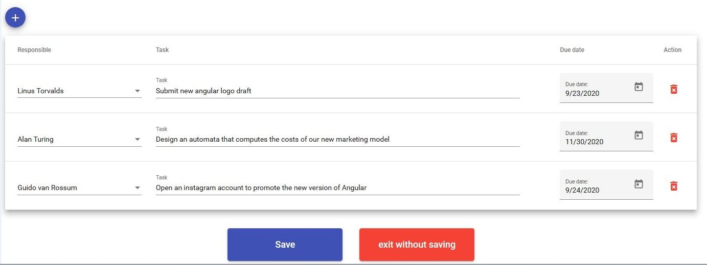

# meetingsTracker

This is a small web app to create and track meetings in your team.

Frontend: Angular 10 + material angular

Backend: Spring (Java)

Database: Postgres 12

You can find a sql script file called "origin.sql" to create the tables and insert some required initial data to start using the app.
You also need to configure the application properties file with your own credentials to access your database. 

## Screenshots
### Homepage

### New meeting page

